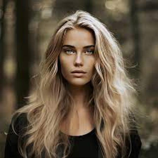
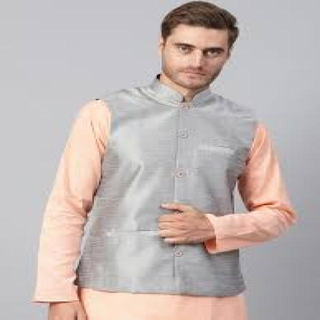

# Real vs Fake Image Tests

Evaluate open source models in their detection of real vs fake images of people. There are a number of such models available but we only test the following:

- **Model-1:** This model is an image classifier that generates real vs fake scores. No explanations are provided.
- **Model-2:** This model is an image classifier that generates real vs fake scores. No explanations are provided.
- **Model-3:** This model is an image classifier that generates human vs artificial scores. No explanations are provided.
- **Model-4:** This model is a general purpose image model that generates real vs fake scores as well as explanations.

## Dataset
The dataset for this test is the [Roboflow Image Detection (Rake & Real) Dataset v1](https://universe.roboflow.com/1-3wzs6/image-detection-fake-real/dataset/1). Here, we test only a small sample to demonstrate proof-of-concept. Note that other image datasets, such as the [Kaggle 140k Real and Fake Faces](https://www.kaggle.com/datasets/xhlulu/140k-real-and-fake-faces) dataset may be used in future tests.

## Process
The testing process comprises the following steps:
- Randomly select sample a set of real and fake images to serve as test dataset.
- For each image in test dataset:
  - For each model:
      - Generate real and fake scores for image.
      - Compare real and fake scores against the actual image type (i.e., Real vs Fake). If the model correctly identifies the image type, then result is 'Pass'. Otherwise, the result is 'Fail'.
- Show performance of each model for each image.

## Test
Short test with 10 images.
|    | image                                                                                    | actual   | model-1   | model-2   | model-3   | model-4   | model-4-expl                                                                                                                                                                                                                                                                                                                                                                                                                                                                                                                                                                                                                                                                                          |
|---:|:--------------------------------------------------------------------------------------------|:---------|:----------|:----------|:----------|:----------|:------------------------------------------------------------------------------------------------------------------------------------------------------------------------------------------------------------------------------------------------------------------------------------------------------------------------------------------------------------------------------------------------------------------------------------------------------------------------------------------------------------------------------------------------------------------------------------------------------------------------------------------------------------------------------------------------------|
|  0 |                                          | Real     | Pass      | Pass      | Pass      | Pass      | The image appears to be a photograph of a woman with long hair, wearing a white top. The woman is holding a strand of her hair in her hand, and the background is out of focus. The image does not appear to be digitally altered or painted, and the woman's features and expressions seem natural and realistic. Therefore, I score the image as real.                                                                                                                                                                                                                                                                                                                                              |
|  1 |                                             | Real     | Pass      | Pass      | Pass      | Pass      | The person in the image appears to be a real individual, with natural-looking facial features and hair. The lighting and shadows on the face are consistent with a real-life photo, and the overall composition of the image suggests that it was taken by a photographer rather than created digitally. There are no obvious signs of digital manipulation or editing, and the image does not have the characteristic smoothness or lack of texture that is often associated with digital art. Overall, based on these factors, I believe that the person in the image is a real person.                                                                                                             |
|  2 |                                             | Fake     | Fail      | Fail      | Pass      | Pass      | The image appears to be a digital painting or illustration, with smooth and unrealistic facial features, and the overall composition and lighting suggest a stylized representation rather than a realistic photograph.                                                                                                                                                                                                                                                                                                                                                                                                                                                                               |
|  3 |                                          | Real     | Pass      | Pass      | Pass      | Fail      | The image appears to be a staged scene, with the people sitting in front of a large window, which is not typical of everyday life. The lighting and shadows suggest that the image has been manipulated to create a specific atmosphere. Additionally, the people's poses and expressions seem too perfect to be candid, suggesting that they may have been posed for the camera. Furthermore, the overall composition of the image, with the people placed in the foreground and the window in the background, suggests that it may have been staged for artistic or commercial purposes. Overall, based on these observations, it is likely that the people in the image are not real.              |
|  4 |  | Real     | Pass      | Pass      | Pass      | Fail      | The image appears to be a digitally altered photograph, as evidenced by the unnatural lighting and the subject's facial expression. The subject's eyes seem to be looking in different directions, and the overall composition of the image suggests that it has been manipulated to create a specific effect. Additionally, the subject's hair appears to be styled in a way that is not consistent with natural hair growth. Furthermore, the background of the image is blurred, which is a common technique used in digital editing to draw attention to the subject. Overall, the image has the hallmarks of a digitally altered photograph, and it is likely that the person shown is not real. |
|  5 |                                              | Real     | Pass      | Pass      | Pass      | Pass      | The image appears to be a real person. The facial features, hair, and clothing are all consistent with a real individual, and there are no obvious signs of digital manipulation or alteration. The overall quality of the image suggests that it was taken with a camera, rather than being a digital illustration or painting. Additionally, the person's pose and expression appear natural and unposed, further supporting the conclusion that the image is real.                                                                                                                                                                                                                                 |
|  6 |                                               | Fake     | Pass      | Fail      | Pass      | Fail      | The image appears to be a photograph of a real person, as it exhibits characteristics such as a natural lighting and shadow pattern, and the subject's features are rendered in a realistic manner. The image does not display any obvious signs of digital manipulation or artificial enhancement, suggesting that it is a genuine photograph.                                                                                                                                                                                                                                                                                                                                                       |
|  7 |                                              | Real     | Pass      | Pass      | Pass      | Pass      | The person in the image appears to be real. The image is a photograph of a man wearing a traditional Indian outfit, and the details of his clothing and pose suggest that it is a genuine photo rather than a digital creation. The lighting and shadows on the image are consistent with a real-world setting, and there are no obvious signs of digital manipulation or editing. Additionally, the image does not have the characteristic smoothness or uniformity of a digitally generated image, which further supports the conclusion that it is a real photograph.                                                                                                                              |
|  8 |                                              | Real     | Pass      | Pass      | Pass      | Pass      | The person in the image appears to be a real individual. The image is not a digital painting, illustration, or AI-generated image, and there is no visible evidence of digital alteration. The person's facial features, hair, and clothing appear to be natural and not artificially created. The image appears to be a photograph of a real person, likely taken with a camera or smartphone. There are no obvious signs of digital manipulation or editing.                                                                                                                                                                                                                                        |
|  9 |                                         | Real     | Fail      | Pass      | Pass      | Fail      | The image appears to be a digitally altered or generated image, likely created using AI or image editing software. The subject's facial features, including the eyes, nose, and mouth, appear to be exaggerated or manipulated for aesthetic purposes. The overall quality of the image is too high and lacks the natural imperfections found in real photographs. Additionally, the subject's clothing and background appear to be digitally manipulated, further supporting the conclusion that the image is fake.                                                                                                                                                                                  |

**Results Overview**

Model 1:
- Pass:    8
- Fail:    2

Model 2:
- Pass:    8
- Fail:    2

Model 3:
- Pass:    10
- Fail:    0

Model 4:
- Pass:    6
- Fail:    4

## Using LLM for Explanation Generation

If an existing model has been shown to work well in accurately distinguishing real from fake images, results from that model can then be used as a basis for having an LLM generate an explanation as to why an image is real or fake. For example, we see that Model 3 has correctly identified all real and fake images. We also see that Model 3 has (correctly) identified Image #6 as Fake. Using this information, we can notify the LLM that Image #6 has been determined to be Fake and to provide an explanation as to why the image is Fake. 

|    | image                                                        | actual   | llm_expl                                                                                                                                                                                                                                                                                                                                                                                                                                                                                                                                                                      |
|---:|:----------------------------------------------------------------|:---------|:------------------------------------------------------------------------------------------------------------------------------------------------------------------------------------------------------------------------------------------------------------------------------------------------------------------------------------------------------------------------------------------------------------------------------------------------------------------------------------------------------------------------------------------------------------------------------|
|  0 |  | Fake     | The image is fake because the hair appears to be digitally altered, with an unnatural and overly smooth texture that lacks the natural volume and movement of real hair. Additionally, the eyes seem to be too large for the face, and the overall facial structure appears to be slightly distorted. Furthermore, the lighting and shading on the face are inconsistent, suggesting that the image may have been heavily edited or generated using AI technology. Overall, the image exhibits a number of visual anomalies that are not typically found in real photographs. |
